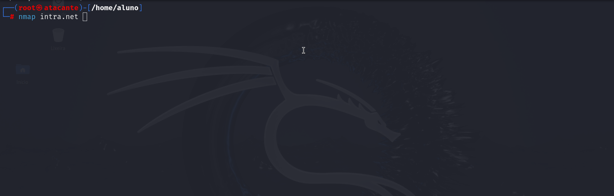
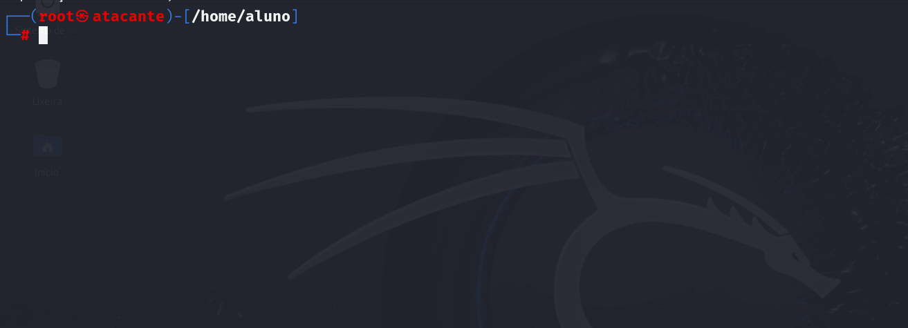
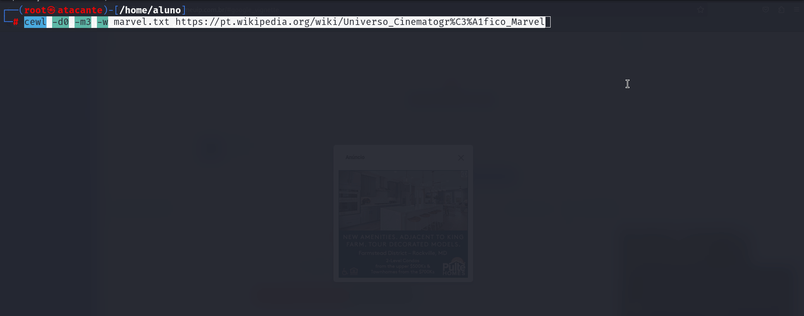
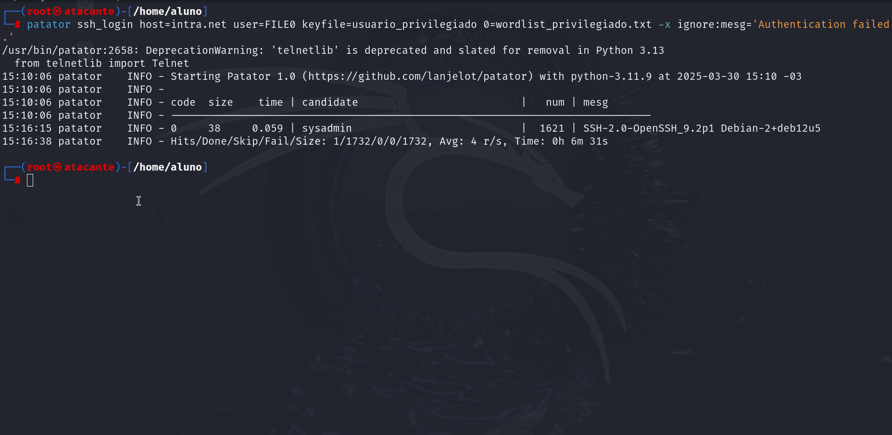
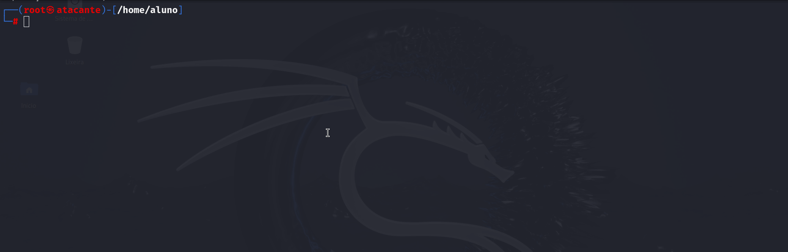
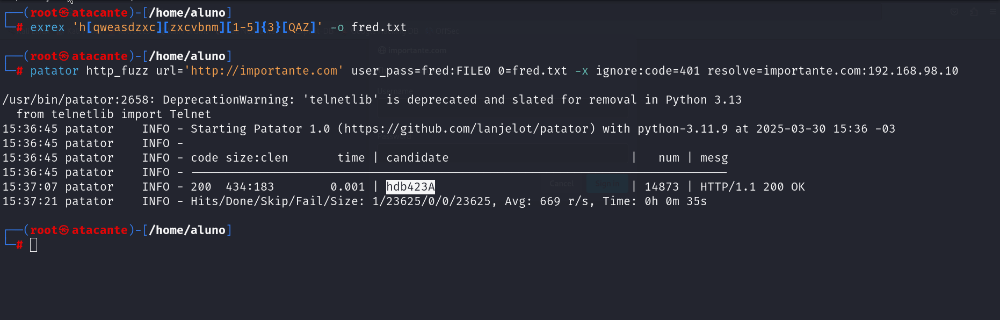

# Hackers Do Bem - Módulo 3 - Atividade 5
⚠️ **O documento em questão destina-se exclusivamente a fins educacionais.** ⚠️

⚠️**As atividades foram executadas em um ambiente controlado, fornecido pela própria instituição de ensino.** ⚠️

ℹ️ ***Informação:*** *Devido a um problema de processamento na ferramenta `peek`, alguns GIFs tiveram parte da execução "cortada".*

**Observação:** Para uma melhor experiência ao visualizar este documento, incluindo a exibição das ações em formato **.gif**, acesse-o em: https://github.com/Douglas-Sadi/HDB-M3-Report-Final

💡 **Dica:** Clique no ▶️ no canto superior direito de cada GIF para iniciar a reprodução. 🎥

## Relatório de Pré-Engajamento - Teste de Penetração

### 1. Objetivo
O objetivo deste teste de penetração é avaliar a segurança dos seguintes ambientes: **intra.net, importante.com e vulneravel.com**, identificando vulnerabilidades nos sistemas e serviços presentes. O escopo do teste inclui:

- Avaliação da infraestrutura;
- Identificação de vulnerabilidades críticas;
- Planejamento de estratégias de mitigação.

### 2. Contexto
O ambiente em questão contém aplicações web e serviços. As principais características incluem:

- Servidores Linux;
- Aplicações Web;
- Serviços como **FTP** ,**SSH** e **HTTP**.

### 3. Tipo de Pentest
Com base na complexidade dos sistemas, o tipo de pentest mais adequado é **caixa cinza**, permitindo testar vulnerabilidades com informações limitadas. As abordagens incluem:

- Testes de intrusão na rede e protocolos;
- Análise de aplicações web;
- Exploração de falhas conhecidas (CVE);
- Testes de configuração em servidores.

### 4. Escopo
#### Elementos incluídos:
- Aplicações web internas;
- Serviços expostos **(HTTP, SSH e FTP).**

#### Elementos excluídos:
- Sistemas de produção críticos;
- Testes de DoS (negação de serviço);

### 5. Comunicação com os Envolvidos
Durante o pentest, serão adotadas as seguintes diretrizes de comunicação:

- Relatórios periódicos enviados à equipe de segurança;
- Reuniões de alinhamento com responsáveis;
- Compartilhamento de documentação relevante.

### 6. Plano de Teste de Penetração
#### Metodologia:
1. **Coleta de informações**: levantamento de informações com técnicas de **OSINT**;
2. **Mapeamento da infraestrutura**: identificação de portas abertas e serviços (**Nmap**);
3. **Análise de vulnerabilidades**;
4. **Execução de ataques controlados**: ataques de força bruta, utilizando ferramentas, como: **FFUF**, **Hydra**, **Patator** e **John The Ripper;**
5. **Documentação dos resultados e mitigação**.

### 7. Acordo de Não Divulgação (NDA)
Um **Acordo de Não Divulgação (NDA)** foi assinado entre as partes para garantir a proteção das informações sensíveis obtidas durante o teste de penetração. O documento cobre:

- Confidencialidade das descobertas;
- Restrições de compartilhamento de informações;
- Penalidades em caso de violação do acordo.

### 8. Autorização Formal
Foi obtida uma **autorização formal** do cliente para a realização do teste de penetração. O documento inclui:

- Assinatura dos responsáveis;

- Escopo e limitações do pentest;

- Prazos e entregáveis.

## Entendendo a Necessidade do Cliente

### 1. **Infraestrutura e Sistemas Presentes no Ambiente Alvo**

A varredura realizada com **NMAP** foi executada no ambiente alvo. Foram identificados os seguintes elementos principais na infraestrutura:

- 🖥️ **Sistemas:** intra.net, importante.com e vulneravel.com  

  🔓 **Portas Abertas e Serviços:** O **NMAP** detectou diversos serviços e funcionalidades em operação nos servidores analisados, como servidores web rodando em portas tradicionais (**por exemplo: 21, 22, 80**, entre outras):

A versão do Apache também foi analisada e, até o momento da elaboração deste relatório, não foram encontrados registros de vulnerabilidades no CVE:

### 2. **Resultados da Verificação de Segurança**

🎯 **Alvos:** `intra.net` e `vulneravel.com` 

🔐 **Execução:** Enumeração, ataque de força bruta.  

🛠️ **Ferramentas:** `ffuf`, `cewl`, `hydra`, `patator`

Através do uso da ferramenta `ffuf`, foi possível realizar a enumeração de usuários presentes no sistema alvo.

A análise dos domínios `intra.net` e `vulneravel.com` resultou em achados semelhantes:

**Esta etapa permitiu a identificação do usuário** **Paulo** no sistema.

**Ao analisar o diretório** `http://intra.net/~Paulo`, foi possível obter informações sobre suas preferências em filmes e séries, no qual possibilitou a criação de listas de palavras personalizadas para ataques de força bruta, com o intuito de descobrir sua senha:

Usamos as ferramentas  `cewl`, e `hydra`.

Após a execução da atividade acima, foi possível obter a **senha do usuário Paulo.**

Em seguida, foi estabelecida uma conexão FTP com esse usuário, permitindo a obtenção de uma chave SSH privilegiada esquecida no diretório. Utilizando a técnica de `password spraying` combinada com `wordlists `personalizadas e a ferramenta `patator`, **foi possível acessar o sistema com um usuário de privilégios administrativos (*sysadmin*):**

⚠️ **Falha Grave:** ⚠️

Devido ao esquecimento ou armazenamento inadequado de um arquivo importante, como a chave privada, foi possível realizar a conexão como **sysadmin**. Caso esta falha seja explorada de forma mal-intencionada, pode resultar em **danos irreversíveis** aos sistemas em questão.

_________________________________________________________________________________________________

🎯 **Alvo:** `importante.com`  

🔐 **Execução:** Ataque de força bruta.  

🛠️ **Ferramentas:** `exrex` e `patator`

Este site utiliza o protocolo HTTP em vez de HTTPS, o que permite o tráfego de dados sem criptografia. Isso significa que, caso um atacante **use ferramentas de análise de tráfego, como o `Wireshark` ,`OWASP-ZAP`, `BurpSuite` **,  é possível **interceptar informações sensíveis** do sistema. No entanto, para o alvo em questão, utilizamos uma abordagem diferente:

Recorremos à técnica de **`shoulder surfing`** (espreitar sobre o ombro) para identificar que o nome do usuário é `fred` e observar padrões de digitação no campo de senha.

Com base nos padrões observados, criamos uma lista personalizada utilizando expressões regulares e a combinamos com a ferramenta **`patator`** para realizar um ataque de força bruta, obtendo a senha do mesmo:

✅ **Logado com sucesso:**

_________________________________________________________________________________________________

🎯 **Alvo:** `vulneravel.com`  

🔓 **Execução:** Quebra de hashes - senhas fracas.  

🛠️ **Ferramenta:** `John The Ripper`

Devido ao uso de senhas fracas e mecanismos de proteção inadequados, foi possível quebrar facilmente os hashes de senhas armazenadas em texto claro no sistema em questão:

- ### 3. **Análise das Principais Áreas de Risco**

  Com base no relatório, as áreas mais críticas são:

  - **Acesso não autorizado e senhas fracas**: A obtenção de senhas fracas e o acesso indevido aos sistemas foram os maiores riscos encontrados. Em **intra.net**, por exemplo, a senha de um usuário foi descoberta a partir de informações pessoais, e o acesso ao sistema com privilégios administrativos foi possível devido ao armazenamento inadequado de uma chave SSH.
  - **Falta de criptografia de tráfego**: A utilização de **HTTP** em vez de **HTTPS** no site **importante.com** permitiu a interceptação de informações sensíveis por meio de ferramentas de análise de tráfego. Isso compromete a confidencialidade dos dados e os torna vulneráveis a ataques de espionagem.
  - **Falhas em proteção contra ataques de força bruta**: Ferramentas como **Hydra** e **Patator** foram utilizadas para ataques de força bruta em sistemas que não implementaram medidas adequadas para limitar tentativas de login, expondo os sistemas a risco de comprometer contas de usuários.
  - **Exposição de informações sensíveis**: A descoberta de informações sobre o usuário **Paulo** em **intra.net** e o subsequente uso dessas informações para personalizar ataques de força bruta são exemplos claros de como a falta de controle sobre dados sensíveis pode ser explorada para obter acesso indevido a sistemas.

- ### 4. **Impacto Potencial de Cada Vulnerabilidade**

  - **Confidencialidade**: O uso inadequado de senhas e a falta de criptografia de tráfego podem expor informações sensíveis, comprometendo a privacidade dos dados. Em particular, o acesso não autorizado a sistemas como o **intra.net** e a interceptação de tráfego em **importante.com** podem revelar credenciais e outros dados privados.
  - **Integridade**: A falta de proteções adequadas contra ataques de força bruta e a exposição de informações sobre usuários, como ocorreu em **intra.net**, permitem que atacantes alterem dados sem autorização. Além disso, a ausência de criptografia adequada e a falta de validações de entrada podem resultar na manipulação de informações críticas.
  - **Disponibilidade**: A exploração de falhas de segurança, como a descoberta de senhas e chaves SSH, pode permitir ataques que sobrecarreguem recursos ou resultem em interrupções de serviço. Falhas como essas podem ser usadas para manipulação de dados ou até mesmo ataques de negação de serviço, se mal-intencionadas.

- ### 5. **Definição do Tipo de Pentest Mais Adequado**

  - **Pentest de Aplicações Web**: Foco em vulnerabilidades web, como senhas fracas e falta de criptografia HTTP, sendo essencial para avaliar falhas de segurança em aplicações web.
  - **Teste de Intrusão de Rede**: Avalia a segurança da infraestrutura, considerando serviços como FTP e SSH, além de identificar portas abertas e serviços vulneráveis.
  - **Recursos e Tempo**: Com recursos limitados, priorize as vulnerabilidades críticas, como senhas fracas e falta de proteção. Para uma análise mais completa, inclua testes de rede e configurações de servidores.

- ### 6. **Escopo e Considerações Adicionais**

  - **Infraestrutura**: O escopo deve incluir todos os serviços expostos como **HTTP, FTP e SSH**, além de considerar a segurança das aplicações web, servidores e configurações associadas aos sistemas **intra.net**, **importante.com** e **vulneravel.com**.
  - **Ferramentas e Técnicas**: O uso de ferramentas como **Nmap**, **FFUF**, **Hydra**, **Patator**, **CEWL** e **John The Ripper** é fundamental para realizar a análise de vulnerabilidades e ataques controlados, conforme as falhas identificadas nos serviços e sistemas analisados

## Definição de Escopo

### Documento de Escopo para o Teste de Penetração

#### 1. **Introdução**

Com base nos resultados, identificamos os seguintes sistemas e serviços que farão parte do escopo do teste de penetração.

#### 2. **Sistemas, Aplicativos e Redes no Escopo**

A seguir, estão os elementos que farão parte do escopo do teste de penetração, considerando sua criticidade e relevância para o objetivo de segurança:

#### 2.1. **Sistemas Web**

### **Sistemas e Infraestruturas Mapeadas**

| Sistema           | Serviços                                        | Criticidade |
|------------------|-----------------------------------------------|-------------|
| **intra.net**    | SSH (porta 22), HTTP (porta 80), FTP (porta 21) | Alta (contém informações internas sensíveis) |
| **importante.com** | SSH (porta 22), HTTP (porta 80), FTP (porta 21) | Média (site corporativo com informações sigilosas) |
| **vulneravel.com** | SSH (porta 22), HTTP (porta 80), FTP (porta 21) | Alta (armazenamento de credenciais e dados confidenciais) |

#### 3. **Exclusões do Escopo**

- Os seguintes elementos **estão fora do escopo** do teste de penetração:
  - Redes de terceiros ou provedores externos;
  - Servidores de backup e infraestruturas redundantes;
  - Sistemas que contenham informações regulamentadas por compliance restritivo.

#### 4. **Áreas Críticas**

- O escopo **priorizou**:
  - Sistemas com credenciais expostas ou falhas de autenticação;
  - Ambientes que utilizam comunicações não criptografadas (HTTP em vez de HTTPS);
  - Servidores que apresentaram vulnerabilidades na varredura inicial.

## Documentação

### Plano de Teste de Penetração

#### 1. **Objetivos do Pentest**

- Identificar e explorar vulnerabilidades existentes;
- Avaliar a eficácia das políticas de segurança implementadas;
- Testar a resistência do ambiente contra ataques reais;
- Fornecer recomendações para mitigação de riscos identificados. 

#### 2. **Etapas e Metodologias**

- **Coleta de informações** (Reconhecimento Ativo e Passivo).
- **Enumeração e varredura** (Identificação de serviços e vulnerabilidades).
- **Exploração** (Testes de exploração e privação de segurança).
- **Escalação de privilégios** (Tentativa de acesso administrativo).
- **Relatório final e recomendações**.

#### 3. **Modelo de Documentos**

##### 3.1. **Relatório de Teste**

- **Título**: Relatório de Teste de Penetração.
- **Data**: (Início e término do teste).
- **Resumo Executivo**: Breve descrição do teste, objetivos e principais resultados.  
- **Vulnerabilidades Encontradas**: Listagem das vulnerabilidades identificadas, classificadas por risco (crítico, alto, médio, baixo), com recomendações de mitigação.  
- **Impacto Potencial**: Explicação dos possíveis danos que a exploração das vulnerabilidades pode causar, como perda de dados, controle de sistemas ou indisponibilidade de serviços.  
- **Ferramentas Utilizadas**: Listagem das ferramentas e técnicas aplicadas.  
- **Conclusões e Recomendações**: Sumário das ações necessárias para melhorar a segurança do ambiente.  

##### 3.2. **Registro de Atividades**

- **Data e Hora**: Registro detalhado de todas as ações realizadas, desde o reconhecimento até a exploração;
- **Ação Executada**: Descrição da etapa realizada;
- **Ferramentas Utilizadas**: Indicação da ferramenta ou técnica aplicada em cada atividade;
- **Resultado Obtido**: Resultado da ação (ex.: vulnerabilidade encontrada, falha explorada, falha corrigida).  

##### 3.3. **Evidências de Vulnerabilidades**

- Capturas de tela dos resultados de testes e explorações.  
- Logs e relatórios gerados por ferramentas, incluindo provas de conceito de vulnerabilidades exploradas.  

#### 4. **Desafios Enfrentados**

Qualquer obstáculo ou dificuldade encontrada durante o teste será documentado, como:

- Restrições de acesso a determinados sistemas ou servidores.  
- Limitações de tempo ou recursos disponíveis.  
- Detecção de mecanismos de defesa ou mitigação já implementados.  

#### 5. **Contrato Formal**

O contrato formal de pentest incluirá as seguintes cláusulas:

- **Confidencialidade**: Garantir que todas as informações obtidas durante o pentest sejam tratadas de forma confidencial.  
- **Propriedade Intelectual**: Especificar que os resultados e relatórios gerados pertencem ao ambiente em questão.
- **Limitações de Responsabilidade**: Definir que o teste será realizado de forma controlada e que eventuais falhas exploradas serão informadas ao cliente, sem causar danos irreparáveis aos sistemas.  

## Linhas de Comunicação com os Envolvidos

### Plano de Comunicação e Colaboração – Teste de Penetração

#### 1. **Relatório Resumido de Vulnerabilidades**

O relatório resumido destina-se à equipe técnica e aos responsáveis pelo ambiente testado e destaca as principais vulnerabilidades identificadas durante a varredura de segurança.

#### 2. **Reunião de Apresentação dos Resultados**

Para apresentar e discutir os resultados da varredura de vulnerabilidades, será agendada uma reunião com a equipe dos ambientes testados e os responsáveis pelo projeto. O objetivo é garantir que todos os envolvidos entendam as vulnerabilidades encontradas, as etapas subsequentes e as recomendações.

##### **Agenda da Reunião**:

- **Introdução**: Resumo do objetivo do pentest e da varredura de vulnerabilidades.  
- **Apresentação dos Resultados**: Discussão dos pontos críticos do relatório.
- **Próximas Etapas**: Definição das fases subsequentes do pentest e prazos.  
- **Discussão Aberta**: Esclarecimento de dúvidas e alinhamento de expectativas.  

#### 3. **Linhas de Comunicação com os Envolvidos**

##### 3.1. **Comunicação Frequente**

Será mantido contato frequente com o (a) **gerente de projetos ou gerente de segurança** responsável, para compartilhar atualizações sobre o progresso do pentest, esclarecer dúvidas e alinhar expectativas sobre prazos, escopo e prioridades.

##### 3.2. **Canal de Comunicação**

Serão estabelecidos canais de comunicação eficientes, como:

- **Reuniões semanais**: Para compartilhar o andamento das atividades e discutir os próximos passos.  
- **Atualizações por e-mail**: Para envio de resumos periódicos com os resultados obtidos e ajustes no escopo.  
- **Plataforma de Gestão de Projetos**: Utilização de uma ferramenta colaborativa para rastreamento das atividades e vulnerabilidades encontradas.  

#### 4. **Contrato Formal e NDA (Non-Disclosure Agreement)**

##### 4.1. **Contrato Formal**

Será elaborada a contribuição para o contrato formal, em conjunto com o departamento legal e o (a) gerente de projetos. O contrato deverá abordar:

- **Escopo do Pentest**: Definir as áreas e sistemas que serão testados, conforme o escopo detalhado na atividade anterior.  
- **Responsabilidades**: Estabelecer as responsabilidades da equipe de pentest e dos envolvidos.  
- **Prazos e Entregáveis**: Definir o cronograma das atividades e os relatórios a serem entregues.  
- **Limitações de Responsabilidade**: Especificar as limitações e responsabilidades em caso de falhas exploradas ou incidentes durante o teste.  
- **Propriedade Intelectual**: Garantir que todos os relatórios e resultados gerados durante o pentest sejam de propriedade do cliente.  

##### 4.2. **Acordo de Confidencialidade (NDA)**

A equipe colaborará com a **elaboração do NDA** para garantir a proteção adequada das informações confidenciais. O NDA deverá incluir:

- **Informações Sensíveis e Críticas**: Identificar as informações que devem ser protegidas, como detalhes sobre a infraestrutura, relatórios de vulnerabilidades e resultados do pentest. 	
- **Obrigações de Confidencialidade**: Definir que todas as informações obtidas durante o pentest são confidenciais e não podem ser compartilhadas ou divulgadas sem autorização.  
- **Penalidades por Violação**: Incluir cláusulas claras sobre as consequências e penalidades em caso de quebra de confidencialidade.  

#### 5. **Revisão do Contrato e NDA**

Após a elaboração do contrato formal e do NDA, será feita uma revisão minuciosa para garantir que todas as necessidades e requisitos específicos do pentest estejam contemplados, e que as obrigações de confidencialidade sejam claras e compreensíveis.

## Autorização

### Procedimentos para Obtenção de Autorização Formal para o Teste de Penetração

#### 1. Submissão da Documentação Completa

A documentação completa e detalhada sobre o teste de penetração será submetida ao cliente para obter a autorização formal para prosseguir com as atividades. Os documentos enviados incluirão:

- **Plano de Teste de Penetração**: O escopo, objetivos, metodologia e etapas detalhadas do pentest.
- **Relatório Resumido de Vulnerabilidades**: Destacando as principais vulnerabilidades encontradas durante a varredura inicial e as ações recomendadas.
- **Contrato Formal**: Definindo obrigações, responsabilidades, prazos, limitações de responsabilidade e propriedade intelectual.
- **Acordo de Não Divulgação (NDA)**: Garantindo a proteção das informações sensíveis e confidenciais do cliente.

#### 2. Assinatura do NDA (Non-Disclosure Agreement)

Certifique-se de que todas as partes envolvidas assinem o Acordo de Não Divulgação (NDA), garantindo que os dados sensíveis do Laboratório de Segurança sejam protegidos e que não ocorra divulgação não autorizada de informações. A assinatura do NDA é um pré-requisito para o início do pentest.

- **Ações**:
    - Enviar o NDA para assinatura de todas as partes envolvidas (equipe de pentest, cliente, gerente de segurança e departamento legal).
    - Confirmar a assinatura de todas as partes antes de prosseguir com o teste.

#### 3. Requisitos Legais e Regulamentares

Antes de iniciar o pentest, é essencial verificar e garantir que todas as normas legais e regulatórias específicas aplicáveis ao setor e ao ambiente sejam seguidas.

- **Passos**:
    - **Análise de conformidade regulatória**: Verificar se há requisitos específicos, como normas de proteção de dados (ex.: LGPD, GDPR) ou padrões de segurança (ex.: PCI-DSS, ISO/IEC 27001).
    - **Adequação do escopo e métodos**: Garantir que o teste de penetração esteja em conformidade com essas regulações e que qualquer atividade potencialmente sensível seja realizada dentro dos limites legais.

#### 4. Revisão e Atualização Regular da Documentação

A documentação deverá ser revisada e atualizada conforme necessário, especialmente em caso de mudanças no escopo, metodologia ou cronograma do pentest. Assegure-se de que todas as alterações sejam refletidas na documentação de forma precisa e estejam alinhadas com os requisitos do cliente.

- **Frequência de Revisão**: A documentação será revisada em cada fase crítica do projeto, e quaisquer mudanças deverão ser formalizadas e comunicadas às partes envolvidas.

#### 5. Obtenção da Autorização Formal

Após a submissão de toda a documentação e assinatura do NDA, o cliente deverá fornecer uma autorização formal para iniciar o pentest.

- **Ação**:
    - Confirmar o recebimento da autorização por escrito (e-mail, assinatura digital ou documento físico).
    - Garantir que todas as condições estabelecidas no contrato e NDA estejam atendidas antes de prosseguir com o teste.

Com a documentação enviada, o NDA assinado e a verificação dos requisitos legais, o próximo passo será obter a autorização formal do cliente. Após a confirmação, o teste de penetração poderá ser conduzido de acordo com o plano previamente definido.

